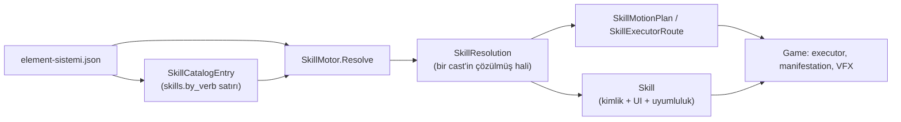

# Mimari (ARCHITECTURE.md)

Tek belge: hedef plan, bugünkü katmanlar, Core sırası, skill modeli, isimlendirme ve veri sözlüğü.
İş sırası `docs/PLAN.md`; konu haritası `docs/MAP.md`; oyun özeti `docs/OYUN.md` (sayılar üretilir).

## Bugün / hedef

| Konu | Bugün (kod) | Hedef (aşağıdaki plan) |
|------|-------------|------------------------|
| Katmanlar | **Core** + **App** + **Game** (+ Composition, DevTools, Editor asmdef) | Domain / Application / Infrastructure / Presentation / Composition / DevTools / Editor |
| Boss beyni | `App/Boss/BossBrain`, `BossAttackSelector` | Application use case |
| Skill yürütme | `Game/Skills/ManifestationDirector` partial (ClassSizeRatchet ≤3411) | İnce presenter + olaylar |
| Girdi | `HexagonInputController` + `HexagonInputSession` | Presentation Casting |
| Test ağı | Normalize sweep hash, 144/144, PlaySweep tipli erişim | Girdi/boss/dodge otomasyonu (PLAN 2C) |
| Sabitler | `*Defaults` const; oynanış literal ratchet | JSON/tuning; const = geçici taşıma (kural 5) |

---

## Hedef plan

Kaynak: 2026-10-04 mimari analizi (master `4b8eb94`). İş sırası `docs/PLAN.md` Aşama 2'dedir.
Bu belge **hedefi** anlatır; bugünkü kodun nerede olduğu için `docs/MAP.md`'ye bak.

## Değişmez ilke
- Aşama 2 refaktörleri **davranış değiştirmez**: `dotnet test tools/CoreTests` sayısı ve
  `SweepV2 --all --gate` 1440 sonucu birebir aynı kalır. Aynı kalamıyorsa iş durur, rapor edilir.
- Unity dosyası taşınırken `.meta` ile birlikte taşınır (`git mv` ikisini birden) → GUID korunur.
- `.unity` / `.prefab` elle düzenlenmez (kök `AGENTS.md`).

## Kararlaştırılan hedef
- Katmanlar: Domain / Application / Infrastructure / Presentation / Composition / DevTools / Editor
- Namespace Dovus.<Katman>.<Konu> = klasör
- Application: CastPipeline, BossBrain, CombatWorld/Simulation; komut alır, olay yayar; IClock/IRng
- Presentation olayları dinler; ManifestationDirector olay→görsel eşleyiciye küçülür
- Sonek kuralı: domain soneksiz, …Rules, …Catalog, …Pipeline/…Service, …View/…Hud/…Presenter; sürüm adları kalkar


## Hedef klasör ve katman yapısı
**İlke:**
- Önce **context**, sonra **katman**.
- Domain ve Application saf C# (`noEngineReferences: true`), Unity'ye bağlı olanlar ayrı asmdef'lerde.
- Bağımlılık yönü: Presentation/Infrastructure → Application → Domain.

```
unity/Assets/Scripts/
├─ Domain/                          Dovus.Domain.asmdef        (saf C#, referans: yok)
│  ├─ Shared/        SkillId, WeaponId, RuneId, ElementId, ActorId (value type), GameTime, ICombatRng, Vec2
│  ├─ Casting/       Rune, RuneLoadout, Sentence, Syllable, Closing   (bugünkü Grammar: rün dili)
│  ├─ Skills/        Skill (aggregate), Verb, Adjective, SkillMechanic, Hitbox, SkillCatalog(arayüz)
│  ├─ Elements/      Element (enum/tip), ElementPaint, ElementReaction      ← bugün yok
│  ├─ Combat/        Damage, Crit, Armor, Poise, Status, StatusBoard        (yalnız hasar/status)
│  ├─ Movement/      MotionTemplate, PositionOwnership, Dodge*, Displacement
│  ├─ Equipment/     Weapon, WeaponPassive (enum), WeaponSwap
│  ├─ Boss/          Boss (aggregate), BossAttack, BossPhase, BossBrain, WebField
│  ├─ Actors/        Player (aggregate: Hp, Resource, Cooldown, Status), Ally   ← PlayerVitals/ActorStatus'tan
│  └─ Team/          TeamCombo, Portal, Border, ModifierSet (oyuncu başına) ← PortalBorderTeamHooks'tan
├─ Application/                     Dovus.Application.asmdef   (saf C#, ref: Domain) — gerçek asmdef adı **Dovus.App** (`App/`, `Application` Unity API ile çakışır)
│  ├─ Casting/       CastPipeline (MD:1316–1332'nin yeni evi), CastCommand, CastResult/Events
│  ├─ Boss/          BossEncounterService
│  └─ Simulation/    CombatSimulation.Tick(dt, commands) → events (co-op'ta host'ta koşar)
├─ Infrastructure/
│  ├─ Data/          Dovus.Infrastructure.Data.asmdef (saf C#): MiniJson, ElementSystemMapper
│  │                 (JSON → Skill/Weapon/Element tipleri; JsonValue BURADA biter), MotionTemplateMapper
│  └─ Unity/         Dovus.Infrastructure.Unity.asmdef: ResourcesLoader, TuningConfig, PlayerPrefs,
│                    UnityRng/UnityClock adaptörleri, (ileride) Photon/
├─ Presentation/                    Dovus.Presentation.asmdef  (Unity; ref: Application, Domain)
│  ├─ Casting/       HexagonInput (yalnız girdi→CastCommand), HexagonView, InkTrail, SyllableFeedback
│  ├─ Skills/        SkillPresenter (MD'nin kalan görsel kısmı), LivingEffectView, Vfx/
│  ├─ Boss/          BossView, BossTelegraph, BossVisual, BossReactor
│  ├─ Actors/        ActorVisual, ActorPose, KinematicMotor, WeaponHandProps, WeaponGripProfile
│  ├─ Camera/        FollowCamera, CameraOrbitInput
│  ├─ Hud/           VitalsHud, DamageNumberHud, StatusIconStrip, CombatOverlayHud, HudTheme
│  ├─ Environment/   CircularArena, LavaDecor, SceneAtmosphere, CombatAmbience*
│  ├─ Audio/         SfxDirector, SfxLibrary
│  └─ Config/        InputTuning, CameraTuning, HudTuning, ArenaTuning… (PrototypeTuning'in parçaları)
├─ Composition/                     Dovus.Game.Composition.asmdef: GameBootstrapHost, AssetCatalog, Builders
├─ DevTools/                        Dovus.Game.DevTools.asmdef (define: UNITY_EDITOR || DOVUS_DEBUG): TuningPanel, V611→DebugPanel,
│                                   TeamDebugMenu, FrameTimeHud, DodgePractice, FeelPlayVerify
└─ Editor/                          Dovus.Editor.asmdef: Build/, AssetBinding/ (…Bind), Sweep/ (PlaySweep)
                                    — tek seferlik *Capture*/*Cw* script'leri arşiv dalına
```

**Namespace kuralı:** `Dovus.<Katman>.<Context>`, örneğin `Dovus.Domain.Skills` veya `Dovus.Presentation.Boss`. Klasör ile birebir aynı olur.

**İsim kuralı önerisi:**

| Rol | Sonek |
|---|---|
| Domain nesnesi | sonek yok: `Skill`, `Boss`, `Weapon` |
| Saf kural | `…Rules` (tek sonek; `Math`/`Picker`/`Resolver`/`Policy` buna toplanır) |
| Referans veri | `…Catalog` (tek sonek; `Data`/`Database`/`Library`/`Registry` buna toplanır) |
| Use case | `…Service` / `…Pipeline` |
| Unity bileşeni | `…View` (görsel), `…Hud` (UI), `…Input` (girdi), `…Presenter` (domain → görsel köprüsü) |

Sürüm ve sayı adları (`V611`, `Weapons10`, `Cw3`) tip adlarından kalkar; sürüm bilgisi git'te kalır.

**Taşıma riski ve sırası:**
- Unity dosyalarını `.meta` dosyalarıyla birlikte (`git mv` ikisini birden) taşımak GUID'i korur. Sahne zaten koddan kurulduğu için sahne referansı kırılma riski düşük.
- ScriptableObject asset'leri (`VfxLibrary.asset`, `WeaponVisualRegistry.asset`, `ElementSO`…) script GUID'ine bağlı olduğu için `.meta` korunmalı (tahmin: başka risk yok).
- Önerilen sıra:
  1. Game'i alt klasörlere ayırıp namespace'leri düzeltmek (KÜÇÜK; davranış değişmez).
  2. `Shared` ID value type'ları ile `Element` ve `Skill` tiplerini eklemek, JsonValue'yu mapper'a hapsetmek (ORTA).
  3. Application/CastPipeline'ı Core'a taşımak (BÜYÜK; ana raporda R1).

## Integration testler (Aşama 0.2 ve sonrası)
1. JSON → domain eşleme (144 skill)
2. Asset referans testi (VfxLibrary, WeaponVisualRegistry, proplar)
3. Kayıt/ayar round-trip + sürüm ezme
4. Saat/rastgele adaptör testleri
5. PlayMode sahne smoke (gece/merge öncesi)
6. İleride Photon komut/olay serileştirme
- 1–3 her PR'da CI; 5 sadece gece; az ve hızlı

## Tespit edilen sorunlar (özet, kanıtlar analiz raporunda)
### God class / god config
1. ManifestationDirector: ~7.400 satır, 276 metot, 49 sınıfa bağlı, skill akışı içinde (MD.cs:1316–1332)
2. HexagonInput (1.168): girdi + skill motoru + UI
3. BossDirector (1.154): boss AI Unity tarafında
4. PrototypeBootstrap (922): 77 sınıfa bağlı
5. PrototypeTuning: 243 ayar, 39 dosya bağımlı
6. element-sistemi.json: 231 KB, veri + lore + changelog, 10–12 kez parse
### Katman / izolasyon
7. Game katmansız: 132 dosya tek klasör/namespace; 120 sınıftan 54'ü döngüsel
8. Core içi döngüler: Combat↔Status, Equipment↔Grammar
9. Skill akışı, boss AI, oyuncu canı Unity'de (Core'da değil)
10. Mana Time.deltaTime (PlayerResource.cs:43), diriliş unscaledTime (PlayerVitals.cs:41)
11. Tohumsuz Random (DamagePipeline.cs:25), Random.value (PortalBorderTeamHost.cs:61)
12. Game testleri 6.477 satırlık sahte Unity katmanına (SweepV2) bağımlı
### Anti-pattern
13. Global statik çarpanlar (PortalBorderTeamHooks: 9 dosya / 40 erişim) + 7 singleton
14. Skill ID switch'leri: PortalSystem 20, TeamComboSystem 18; 88 string ID, 234 string case; pasifler string
15. 59 FindAnyObjectByType/Camera.main; KinematicMotor.cs:86 her karede GetComponent
16. Build git'te olmayan dosyalara bağlı: VfxLibrary 28 eksik referans, WeaponVisualRegistry 6/6 anim seti yok
17. Kural/kod çelişkisi (SkillMotionMotor "ölü" deniyor ama çağrılıyor); 4.479 satır capture script; 85 merge edilmiş branch; ~2.900 sabit sayı
18. Hit-stop tüm dünyayı donduruyor (co-op engeli)
### İsimlendirme / klasör
19. Core'da konu + teknik tür karışık (Tuning/Presentation/Execution); Boss ve Element'in klasörü yok; Combat çöplük (47 dosya)
20. Namespace≠klasör (Game tek namespace, SkillExecution, Editor'de 2 namespace)
21. Sonek karmaşası (Catalog/Data/Profile/Loader/Library/Registry/Database; Director/System/Host/Hooks/...); SkillMotor yanıltıcı
22. Çok konulu/geçici adlar: PortalBorderTeam*, Prototype*, TeamActor/AllyDummy/IAllyPlayer
23. Sürüm/sayı adları: Weapons10, V611DebugPanel, FeelCaptureCw3, SweepV2; yorumlarda T8/T10/K1 kodları
24. Türkçe/İngilizce karışık tanımlayıcılar ve veri sözcükleri
25. Dosya adı≠tip (10 dosya), çok tipli dosyalar (PortalSystem 13), yanlış yerde dosyalar (MiniJson, HexagonLayout, TouchButtonGesture, DamageNumberFormat)
### DDD
26. Rune enum'unda eski "element = rün" dili
27. Tek Skill kavramı yok, 6–8 paralel model
28. Kavramlar string (SkillId, element, sıfat "2"); ham JSON Game'e sızıyor (104 erişim)
29. Entity/aggregate yok: oyuncu Core'da yok, hedefler Transform
30. SkillResolution 41 alan (24 string)
31. Anemik model, 85 statik kural sınıfı; skill yan etkileri event değil doğrudan çağrı
32. Repository arayüzü yok, katalog = parser + factory + depo

---

## Core katman sırası

Üst klasör grafiği: `tools/CoreTests/CoreLayeringTests.cs` (Tarjan SCC kapısı).

## Hedef bağımlılık yönü (alttan üste)

1. **Shared** — JSON (`MiniJson`), kimlik enum'ları (`PortalOp`, `TeamOp`, `SlamVariant`), `ResourceTracker`, paylaşılan yardımcılar. Core içi çıkış yok.
2. **Border, Time, Hud** — sahne/çerçeve; Core içi çıkış yok veya yalnız Shared.
3. **Data** — `element-sistemi.json` ve diğer ham belge kökleri; yalnız Shared'a bağımlı.
4. **Element, Input** — rün kimliği (`Rune`, `RuneLoadout`), altıgen geometri (`HexagonLayout`, `JumpKind`).
5. **Tuning** — tüm `*Tuning` serileştirme tipleri + `CombatTuning` kökü; Shared (ve gerektiğinde Manifestation sayıları).
6. **Presentation, Mechanic, Manifestation** — görsel/mechanic planlama; Data + Grammar + Motion'a doğru tek yön.
7. **Grammar** — `SkillMotor`, `SentenceEngine`, `SkillEngineModifiers`; Data + Element + Input.
8. **Motion, Portal, Team** — dünya hareketi ve takım/portal kuralları; Grammar ve alt katmanlar.
9. **Dövüş konu klasörleri** — `Boss`, `Casting`, `Damage`, `Dodge`, `Equipment`, `Passives`, `Status`: oyun döngüsü; birbirine sıkı bağlı kalan SCC (2B.6c allowlist). Yeni çapraz `using` eklemeden önce alt katmana tip çekin.

## 2B.6c sonrası ölçüm

- **Kırılan döngüler:** Data↔Grammar/Team/Portal; Element↔Grammar; Input↔Grammar; Tuning↔dövüş; Equipment↔Grammar (#106); Combat↔Status (2B.6a).
- **Kalan SCC (1):** Boss, Casting, Damage, Dodge, Equipment, Grammar, Passives, Status — kapı testinde açık izinli; sayı ratchet ile yeni SCC yasak.

## Game katmanı (2B.18a)

Üst klasör grafiği: `tools/CoreTests/GameLayeringTests.cs` (Editor hariç).

- **Composition** — yalnız bootstrap/kurucular (`GameBootstrapHost`, `Composition/Builders/*`); runtime klasörler `Dovus.Game.Composition` kullanmaz.
- **Platform** — Unity saat/RNG + `GameClockHost`, `AssetCatalog`, `PlaceholderFactory` (çapraz kesen, yaprak).
- **Diagnostics** — `DebugConfig`, debug HUD arayüzleri (`ISentenceDebugSink`); runtime → DevTools doğrudan bağımlılık yok (kurulum Composition/Builders).
- **DevTools** — debug HUD/paneller; yaprak hedefi (Grammar/Tuning panel statikleri için küçük allowlist).
- **Kalan SCC (1, boyut ≤15):** Actors, Arena, Boss, Cameras, Casting, Config, Data, DevTools, Feel, Hud, Platform, Skills, Team, Vfx, Weapons — Composition bu bileşenin dışında.

---

## Skill modeli

Tek kavram haritası: JSON katalog → çözülmüş cast → yürütme planı. Rün (`Rune`) ≠ element (`ElementId`, `elements[]`).

## Akış



## SkillResolution (2B.14b)

Üst düzey alanlar (≤12): `Identity`, `Presentation`, `Combat`, `Scaling`, `Length`, `Costs`, `Targeting`, `Mechanics`, `Engine`, `Effects`, `Prose`, `IsComplete`.

| Grup | İçerik |
|------|--------|
| `Identity` | `SkillId`, `ElementId`, `RuneId` fiil/sıfat, display/job, flavor |
| `Presentation` | `*Wire` hitbox/action/family/anim, silhouette |
| `Combat` | base damage/poise/heal, crit, damage type |
| `Scaling` | damage/hitbox/poise çarpanları |
| `Length` | rün sayısı, role/mobility wire, cast/resource mult |
| `Costs` | cooldown + resource |
| `Targeting` | target mode + cast mobility wire, behaviors |
| `Engine` | `SkillEngineModifiers` (ham `engine` JSON Core içinde) |
| `Effects` | `SkillSpecialReader` / `SkillZoneEffectReader` (Game'e `JsonValue` sızmaz) |

Kapalı küme JSON string'leri `HitboxWire`, `CastMobilityWire`, `TargetModeWire`, `VerbFamilyWire`, `SkillActionWire`, `LengthMobilityWire`, `LengthRoleWire` ile parse edilir; bilinmeyen değer `Unknown` + ham `Raw` saklanır, `ToString()` wire metnini verir.

Motor girişi: `SkillResolution.Build(...)` (eski ctor parametreleri; çağrılar güncellendi).

## Tipler ve karar

| Tip | Rol | Karar |
|-----|-----|--------|
| `SkillCatalogEntry` | Ham skill satırı (id, engine JSON, prose) | **Tut** — `SkillMotor` katalog deposu |
| `SkillResolution` | Tek cast'in tüm mekanik alanları | **Tut** — gruplu + tipli kimlikler |
| `Skill` | `SkillResolution` + silah uyumu + element boyası + display adı | **Tut** — `Id` → `SkillId` |
| `SkillFactory` | Rün id'lerinden `Skill` üretir | **Tut** |
| `SkillMotionPlan` | Saf hareket planı (konum yazmaz) | **Tut** — `SkillMotionMotor` üretir |
| `SkillExecutorRoute` | Executor türü + parametreler | **Tut** — `SkillExecutorRouter` |
| `SkillEngineModifiers` | `engine` JSON'dan türetilmiş bayraklar | **Tut** — `Engine` özelliği |
| `SkillExecutionContext` | Game executor'a geçilen anlık bağlam | **Tut** — Unity yürütme |
| `SkillPresentation` | Hitbox/anim prezentasyon | **Tut** — Game katmanı |

## Gelecek iş

- `SkillCatalogEntry` ile `Skill` birleştirmesi ayrı PR.
- Public API'lerde kalan `string skillId` parametreleri → `SkillId` (kısmi; PR notunda "kalan" listesi).


## Gelecek iş (genişletme)

Paralel temsiller (~14) hâlâ var; birleştirme PLAN 2B.14 / A27 açık.

---

## İsimlendirme

## Tek dil (A24, PLAN 2B.13)

- **Kod tanımlayıcıları** (tip, metot, alan, yerel değişken, const): **İngilizce**.
- **Yorumlar** Türkçe olabilir.
- **Veri sözcükleri** (JSON anahtarları, fiil/sıfat kimlikleri, `bag_hatti`, `iki_kez` gibi): yalnızca string sabitlerinde; mümkünse ilgili `*Defaults` / JSON etiketlerinde tutulur (`*Keys` sınıfı repoda yok — geçici dağınık string). Bilinçli Türkçe serileştirilmiş alanlar bu belgedeki veri sözlüğü bölümü ve `[FormerlySerializedAs]` ile korunur.

# İsimlendirme (PLAN 2B.12)

## MonoBehaviour sonekleri (Game sahne bileşeni)

| Sonek | Rol |
|-------|-----|
| `*Director` | Oyun akışı orkestratörü |
| `*View` | Görsel sunum |
| `*Hud` | UI katmanı |
| `*Host` | Sahneye bağlanan tek örnek kabuk (Core sistem taşıyıcısı) |
| `*Controller` | Girdi / kontrol |

## Saf sınıf sonekleri

| Katman | Sonek | Durum |
|--------|-------|-------|
| App / Core (durumsuz) | `*Rules`, `*Math` | App: `BossDirectorRules`, `BossApproachRules`, … |
| Game (durumlu, MonoBehaviour değil) | `*Runtime`, `*Service` | `WeaponPassiveRuntime`, `TemplateDeliveryRuntime`, … |
| Veri | `*Catalog`, `*Table` | `EquipmentCatalog`, `TeamModifierTable`, … |

## Game `MonoBehaviour` dağılımı (2026-10-04, PLAN 2B.12b)

Toplam **79** bileşen (iç içe yardımcılar dahil); **79 / 79** standart sonekle biter. `NamingConventionTests.Game_MonoBehaviours_UseStandardSuffix` kapısı
yeni bileşenlerde de bunu zorlar.

### 2B.12b yeniden adları (58)

Kural: `git mv` dosya + `.meta` (GUID aynı → sahne/prefab bağı korunur), `<Eski>Defaults` → `<Yeni>Defaults`. Bilinçli olarak DEĞİŞMEYENLER:
GameObject adları (`"AllyDummy"`, `"InkTrail"`, `"TuningPanel"`, `"CombatFeel"`, `"BuildSelectScreen"`, `"ReactionReadout"`, `"CastFlash"`,
`"ElementRadialMenu"`, `"TeamDebugMenu"`), log etiketleri (`[SkillExecutor]`, `[FollowCamera]` — PlaySweep ölçümü `[SkillExecutor]` önekini arar),
`[Header]` metinleri, JSON/CSV içerikleri ve tip adıyla başlayan diğer tipler (`HexagonInputSession`, `SkillExecutorRouter`, `ActorStatusTeamMoveSpeed`…).
`WorldContext` alanları ve `ICastSideEffectsHost` özellikleri tip adıyla birlikte yeniden adlandırıldı (ör. `ctx.PlayerVitalsHost`).

| Eski | Yeni |
|------|------|
| `ActorGrounding` | `ActorGroundingController` |
| `ActorPose` | `ActorPoseView` |
| `ActorStatus` | `ActorStatusHost` |
| `ActorVisual` | `ActorView` |
| `AllyDummy` | `AllyDummyController` |
| `DodgeMotion` | `DodgeMotionController` |
| `FootstepEmitter` | `FootstepView` |
| `KinematicMotor` | `KinematicMotorController` |
| `MotionTemplateBody` | `MotionTemplateBodyHost` |
| `PlayerCooldown` | `PlayerCooldownHost` |
| `PlayerDodgeRig` | `PlayerDodgeController` |
| `PlayerResource` | `PlayerResourceHost` |
| `Targetable` | `TargetableHost` |
| `PlayerTargeting` | `PlayerTargetingController` |
| `PlayerVitals` | `PlayerVitalsHost` |
| `TeamActor` | `TeamActorHost` |
| `AttackTelegraph` | `AttackTelegraphView` |
| `BossHitFlinch` | `BossHitFlinchView` |
| `BossReactor` | `BossReactorController` |
| `BossTelegraph` | `BossTelegraphView` |
| `BossVisual` | `BossView` |
| `HostileTargets` | `HostileTargetsHost` |
| `CameraOrbitInput` | `CameraOrbitController` |
| `FollowCamera` | `FollowCameraController` |
| `ElementRadialMenu` | `ElementRadialMenuHud` |
| `HexagonInput` | `HexagonInputController` |
| `HexagonOverlayCamera` | `HexagonOverlayCameraView` |
| `InkTrail` | `InkTrailView` |
| `MoveInput` | `MoveInputController` |
| `SyllableFeedback` | `SyllableFeedbackView` |
| `GameBootstrap` | `GameBootstrapHost` |
| `GameClock` | `GameClockHost` |
| `DodgePractice` | `DodgePracticeController` |
| `FeelPlayVerify` | `FeelPlayVerifyController` |
| `GrammarDebugPanel` | `GrammarDebugHud` |
| `TeamDebugMenu` | `TeamDebugHud` |
| `TuningPanel` | `TuningPanelHud` |
| `CombatFeel` | `CombatFeelDirector` |
| `VisualFreeze` | `VisualFreezeView` |
| `BuildSelectScreen` | `BuildSelectHud` |
| `ReactionReadout` | `ReactionReadoutHud` |
| `StatusIconStrip` | `StatusIconStripHud` |
| `ComposedSkillVfx` | `ComposedSkillVfxView` |
| `SkillExecutor` | `SkillExecutorController` |
| `AfterimageTrail` | `AfterimageTrailView` |
| `BillboardVfx` | `BillboardVfxView` |
| `CastFlash` | `CastFlashView` |
| `FxTween` | `FxTweenView` |
| `GroundScarField` | `GroundScarFieldView` |
| `HitFlash` | `HitFlashView` |
| `PresentationFx` | `PresentationFxView` |
| `WeaponGripProfile` | `WeaponGripView` |
| `WeaponHandProps` | `WeaponHandPropsView` |
| `WeaponPropIdleMotion` | `WeaponPropIdleView` |
| `HoldSurface` (iç içe, `ElementRadialMenuHud`) | `HoldSurfaceController` |
| `ScreenAnchoredCorner` (iç içe, `TuningPanelHud`) | `ScreenAnchoredCornerView` |
| `Runner` (iç içe, `UiJuice`) | `UiJuiceRunnerHost` |
| `FollowAnchor` (iç içe, `HitboxVfxRegistry`) | `FollowAnchorView` |

**Başka dallar için:** yukarıdaki eski adları kullanan kod birleştirmede yeniden adlandırılmalı (dosya yolları da değişti).

## 2B.12 tip yeniden adları

| Eski | Yeni |
|------|------|
| `PortalBorderTeamHost` | `TeamComboHost` |
| `PortalBorderTeamAccess` | `TeamComboAccess` |
| `PortalBorderTeamDefaults` | `TeamComboDefaults` |
| `PrototypeBootstrap` | `GameBootstrap` (2B.12b: `GameBootstrapHost`) |
| `PrototypeTuning` | `GameTuning` (düz `[Serializable]` alan: Unity alan adıyla bağlar → `MovedFrom` gerekmez; sahne/`tuning.json` alan adları aynı) |
| `V611DebugPanel` | `GrammarDebugPanel` (2B.12b: `GrammarDebugHud`) |

`Weapons10` tip adı Scripts altında yok (2B.2f). `SweepV2` araç adı; kod tipi değil.

Bilinçli olarak DEĞİŞMEYENLER: sahne dosyası `Prototype.unity` (ve içindeki `m_EditorClassIdentifier` satırı — Unity GUID ile bağlar, bir sonraki kayıtta kendisi günceller), serileştirilmiş alanlar `_prototypeMainClassId`/`_prototypePassiveRuneIds`, `Resources/Bosses/*.json` içindeki belge amaçlı `"PrototypeTuning.PlayerMaxHp"` `maps_to` anahtarları (kod okumuyor). Görünür GameObject adları değişti: `TeamComboHost` (eski host adı), `GrammarSimpleControls` (eski `V611SimpleControls`); ada göre arayan kod yok.

**Başka dallar için:** eski tip adlarını (`PrototypeTuning`, `PrototypeBootstrap`, `PortalBorderTeam*`, `V611DebugPanel`) kullanan kod birleştirmede yukarıdaki tabloya göre yeniden adlandırılmalı.

## Yorum kodu sözlüğü

Eski PLAN / PR kısaltmaları; yeni yorumlarda tercih: kısa Türkçe cümle. Anlam belirsizse bu tabloya bak.

| Kod | Anlam | Belge |
|-----|-------|-------|
| O1 | Dodge: süre eşiği vs sürükleme eşiği | `Core/Tuning/DodgeTuning.cs` |
| O2 | Tek mükemmel dodge penceresi (PERFECT) | `DodgeTuning`, `ExchangeResolver` |
| O3 | Portal geri vuruş hasar çift sayım düzeltmesi | `TeamComboHost` |
| O4 | Diriliş zamanlayıcısı dünya saati | `PlayerVitalsHost` |
| O5 | Eski `tuning.json` yedekleme | `TuningConfig` |
| O6 | %50 canla başlama debug bayrağı | `DebugConfig` |
| O7 | Tek kalıcı savaş RNG (kritik/sapma) | `CritSystem`, `ManifestationDirector.Damage` |
| O8 | Yay zırh delme bonusu tüketimi | `ManifestationDirector.Damage` |
| O10 | Kanallı skill sırasında silah swap kilidi | `ManifestationDirector.WeaponSwap` |
| O11 | GetComponent / Find tekrarını önbellekleme | çeşitli Game dosyaları |
| F1 | Stasis → yavaşlatma (oyuncu donması kaldırıldı) | `ManifestationDirector.VerbExecution` |
| T1 | İptal penceresi nokta sayısına bağlı | `SentenceEngine`, `ActorPoseView` |
| T4 | Kalıcı zemin izi / gölgesiz telefon | `GroundScarFieldView`, `CombatAmbienceEnvironment` |
| T8.1 | Tuning sürüm yaması (bilinçli 0 korunur) | `GameTuning` |
| T9–T14 | Tuning/HUD/telemetri sürüm yamaları | `GameTuning.Migrate`, `HudSettings` |
| T10 | Canlı ayar paneli + JSON round-trip | `TuningConfig`, `TuningPanelHud`, Core `*Tuning` |
| T11 | Kare süresi HUD / ground scar cap | `FrameTimeHud`, `GameTuning` |
| T12 | Kapanış hasarı HUD aracı (varsayılan kapalı) | `HudSettings`, `ManifestationDirector` |
| A21–A23 | PLAN 2B.12 isimlendirme maddeleri | `docs/PLAN.md` |
| 2B.x | Mimari alt iş kodu | `docs/PLAN.md` |


### SkillMotor adlandırma notu

`SkillMotor` (gramer/katalog) ile `SkillMotionMotor` (saf hareket planı) farklı tipler (A21).

---

## Veri sözlüğü

Kod tanımlayıcıları İngilizce; JSON / fiil kimlikleri / tuning panel alanları gibi **veri sözcükleri** bilinçli olarak Türkçe veya snake_case kalabilir. Bu tablo: veri sözcüğü → kodda karşılık (varsa) → anlam.

| Veri sözcüğü | Kod adı | Anlam |
|--------------|---------|--------|
| `PoseZehir` | `PoseZehir` (serileştirilmiş alan) | Zehir duruşu / görsel pose anahtarı (`ActorPoseView`, `VisualSettings`) |
| `bag_hatti` | — (JSON / log string) | Mekanik: bağ şeridi ile mermi silme |
| `iki_kez` | — (JSON / log string) | Mekanik: çift vuruş / kopya mermi |
| `surekli` | `Continuous` (metot) | Mekanik gramer: sürekli etki kipi |
| `genis_yay` | `WeaponPassiveKind.WideArc` | Pasif: geniş yay |
| `karsi_saldiri` | `WeaponPassiveKind.CounterStrike` | Pasif: karşı saldırı |
| `sirt_vurusu` | `WeaponPassiveKind.Backstab` | Pasif: sırt vuruşu |
| `yere_cakma` | `WeaponPassiveKind.GroundSlam` | Pasif: yere çakma |
| `kosu_atisi` | `WeaponPassiveKind.RunShot` | Pasif: koşu atışı |
| `sabit_nisan` | `WeaponPassiveKind.SteadyAim` | Pasif: sabit nişan |
| `uzun_buyu` | `WeaponPassiveKind.LongEnchant` | Pasif: uzun büyü |
| `kutsal_etki` | `WeaponPassiveKind.HolyEffect` | Pasif: kutsal etki |
| `dolu_sayfa` | `WeaponPassiveKind.FullPage` | Pasif: dolu sayfa |
| `capraz_ates` | `WeaponPassiveKind.CrossFire` | Pasif: çapraz ateş |
| skill kimliği (ör. `3-10`) | `SkillId` + JSON `engine` etiketleri | Runtime `SkillIds.*` yok (#142); davranış gramer/etiketten. |

| (rün id 1..12) | `Rune` (`Attack`, `Heal`, …) | Mekanik rün; **element değil**. Türkçe UI: `RuneInfo.DisplayName`. Eski log/sweep dizesi: `RuneInfo.LegacySerializationName` (ör. `Ates`, `Su`, `Savunma`, `Patlama`, `Karanlik` … — v6 `Saldiri` değil). |
| `elements[]` id | `ElementId` / `ElementPaintNode` | Boya / sınıf elementi; rün enum'undan ayrı kavram. |

---

## Oynanış sabitleri

Oynanış sayıları `Core/*/*Defaults.cs` ve `MagicNumberRatchetTests` / `GameplayLiteralRatchetTests` ile izlenir. Yeni sayı uydurma — spec yoksa varsayılan + PR notu.
