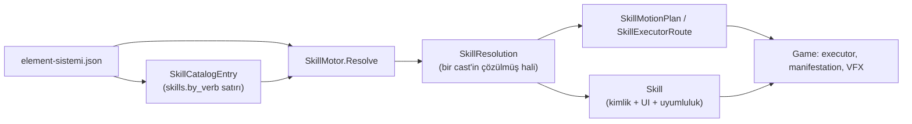

# Skill modeli (PLAN 2B.14a–b / A27, A28, A30)

Tek kavram haritası: JSON katalog → çözülmüş cast → yürütme planı. Rün (`Rune`) ≠ element (`ElementId`, `elements[]`).

## Akış

## SkillResolution (2B.14b)

Üst düzey alanlar (≤12): `Identity`, `Presentation`, `Combat`, `Scaling`, `Length`, `Costs`, `Targeting`, `Mechanics`, `Engine`, `Effects`, `Prose`, `IsComplete`.

| Grup | İçerik |
|------|--------|
| `Identity` | `SkillId`, `ElementId`, `RuneId` fiil/sıfat, display/job, flavor |
| `Presentation` | `*Wire` hitbox/action/family/anim, silhouette |
| `Combat` | base damage/poise/heal, crit, damage type |
| `Scaling` | damage/hitbox/poise çarpanları |
| `Length` | rün sayısı, role/mobility wire, cast/resource mult |
| `Costs` | cooldown + resource |
| `Targeting` | target mode + cast mobility wire, behaviors |
| `Engine` | `SkillEngineModifiers` (ham `engine` JSON Core içinde) |
| `Effects` | `SkillSpecialReader` / `SkillZoneEffectReader` (Game'e `JsonValue` sızmaz) |

Kapalı küme JSON string'leri `HitboxWire`, `CastMobilityWire`, `TargetModeWire`, `VerbFamilyWire`, `SkillActionWire`, `LengthMobilityWire`, `LengthRoleWire` ile parse edilir; bilinmeyen değer `Unknown` + ham `Raw` saklanır, `ToString()` wire metnini verir.

Motor girişi: `SkillResolution.Build(...)` (eski ctor parametreleri; çağrılar güncellendi).

## Tipler ve karar

| Tip | Rol | Karar |
|-----|-----|--------|
| `SkillCatalogEntry` | Ham skill satırı (id, engine JSON, prose) | **Tut** — `SkillMotor` katalog deposu |
| `SkillResolution` | Tek cast'in tüm mekanik alanları | **Tut** — gruplu + tipli kimlikler |
| `Skill` | `SkillResolution` + silah uyumu + element boyası + display adı | **Tut** — `Id` → `SkillId` |
| `SkillFactory` | Rün id'lerinden `Skill` üretir | **Tut** |
| `SkillMotionPlan` | Saf hareket planı (konum yazmaz) | **Tut** — `SkillMotionMotor` üretir |
| `SkillExecutorRoute` | Executor türü + parametreler | **Tut** — `SkillExecutorRouter` |
| `SkillEngineModifiers` | `engine` JSON'dan türetilmiş bayraklar | **Tut** — `Engine` özelliği |
| `SkillExecutionContext` | Game executor'a geçilen anlık bağlam | **Tut** — Unity yürütme |
| `SkillPresentation` | Hitbox/anim prezentasyon | **Tut** — Game katmanı |

## Gelecek iş

- `SkillCatalogEntry` ile `Skill` birleştirmesi ayrı PR.
- Public API'lerde kalan `string skillId` parametreleri → `SkillId` (kısmi; PR notunda "kalan" listesi).
