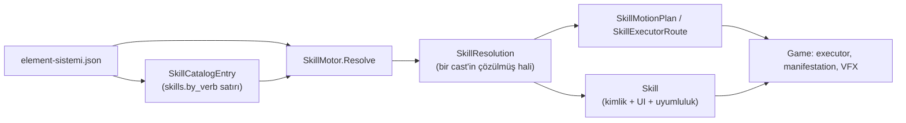

# Skill modeli (PLAN 2B.14a / A27)

Tek kavram haritası: JSON katalog → çözülmüş cast → yürütme planı. Rün (`Rune`) ≠ element (`ElementId`, `elements[]`).

## Akış

## Tipler ve karar

| Tip | Rol | Karar |
|-----|-----|--------|
| `SkillCatalogEntry` | Ham skill satırı (id, engine JSON, prose) | **Tut** — `SkillMotor` katalog deposu; `V61SkillNode` yerine geçer |
| `SkillResolution` | Tek cast'in tüm mekanik alanları | **Tut** — tek çözülmüş kaynak; executor/casting buradan okur |
| `Skill` | `SkillResolution` + silah uyumu + element boyası + display adı | **Tut** — UI / factory yüzeyi |
| `SkillFactory` | Rün id'lerinden `Skill` üretir | **Tut** |
| `SkillMotionPlan` | Saf hareket planı (konum yazmaz) | **Tut** — `SkillMotionMotor` üretir |
| `SkillExecutorRoute` | Executor türü + parametreler | **Tut** — `SkillExecutorRouter` |
| `SkillEngineModifiers` | `engine` JSON'dan türetilmiş bayraklar | **Tut** — ince okuma katmanı |
| `SkillExecutionContext` | Game executor'a geçilen anlık bağlam | **Tut** — Unity yürütme |
| `SkillPresentation` | Hitbox/anim prezentasyon | **Tut** — Game katmanı |

## Gelecek iş (bu PR dışı)

- **A28 / A30:** `SkillResolution` alan sadeleşmesi; `SkillId` / `RuneId` tam benimseme (davranış değiştiren birleştirme yapılmadı).
- `SkillCatalogEntry` ile `Skill` birleştirmesi: katalog satırı hâlâ ham JSON taşıyor; `Skill` ise çözüm sonrası — birleştirme ayrı PR.
